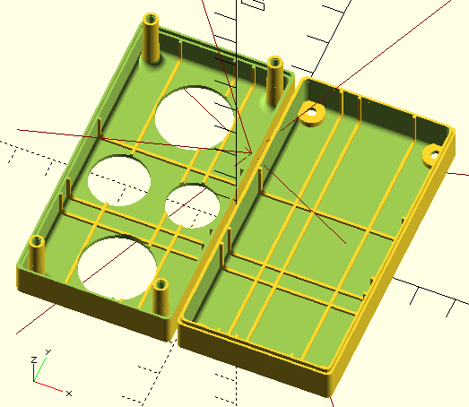
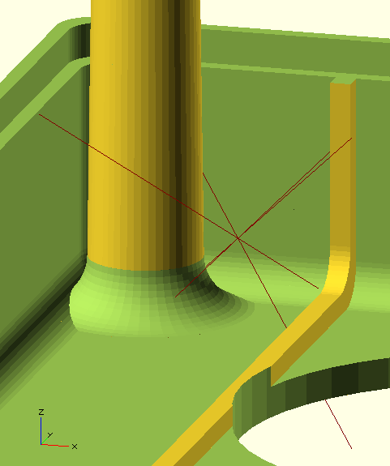
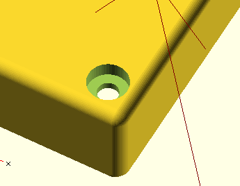

# printableBox
Parametric openSCAD 3d-printable box generator e.g. electronics case with rounded edges, two shells, an overlapping lid.

###Example
Sample box with screws, cutouts and ribs (all optional features)

To run, open "main.scad" in openSCAD and preview or render.

###Features
- Box geometry is freely adjustable in main.scad. 

- Any number of screws can be placed freely (also merged into a rounded edge or corner)

- Cutouts can be placed on top and bottom side, e.g. for switches, ventilation or just a cool swiss-cheese effect (=to speed up test prints)

- Internal ribs can be placed individually, e.g. where box contents allow

### Clipping
Much more complex than envisioned, but hopefully correct (screw boss pads don't stick out, screw heads merge into the wall, cutouts remove ribs underneath)

### Code / implementation notes
Design information is passed in as a hash table. 

"ScrewBoss.scad" shows a reusable module with test cases that gets its input from a shared data structure, identified by a prefix (e.g. if a design needs to use screw bosses of different size)

