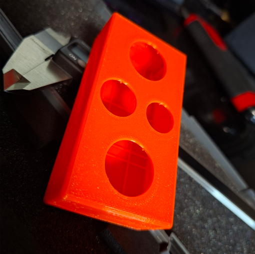

# printableBox
Parametric openSCAD 3d-printable box generator e.g. electronics case with rounded edges, two shells, an overlapping lid.

### Example
Sample box with screws, cutouts and ribs (all optional features)

To run, open "main.scad" in openSCAD and preview or render.

### Features
- Box geometry is freely adjustable in main.scad. 

- Any number of screws can be placed freely (also merged into a rounded edge or corner)

- Cutouts can be placed on top and bottom side, e.g. for switches, ventilation or just a cool swiss-cheese effect (=to speed up test prints)

- Internal ribs can be placed individually, e.g. where box contents allow

### Clipping
Quite a bit more complex than originally envisioned - it's just a box, right? Right...

But, hopefully correct: screw boss pads don't stick out, screw heads merge into the wall, cutouts remove ribs underneath.

### Code / implementation notes
Design information is passed in as a hash table. 

"ScrewBoss.scad" shows a reusable module with test cases that gets its input from a shared data structure, identified by a prefix (e.g. if a design needs to use screw bosses of different size)

### Test prints
No real issues in half a dozen test prints at different design stages (Prusa Core One, Structural 0.15 mm in PETG).

Lessons learned: 
- Use the shortest practical thread length. If longer screws have to be used, the "shank" setting provides a non-threaded hole for most of the screw length (which creates less stress on the screw boss and is more convenient to assemble).
- Shells may not be joined by force, as the final corner may splinter. Slightly breaking each shell's corners (outside-/inside) with a carpet knife avoids this problem. 
- Assembly technique tends to improve with practice :-)
- Strategically placed ribs will significantly improve stiffness.

